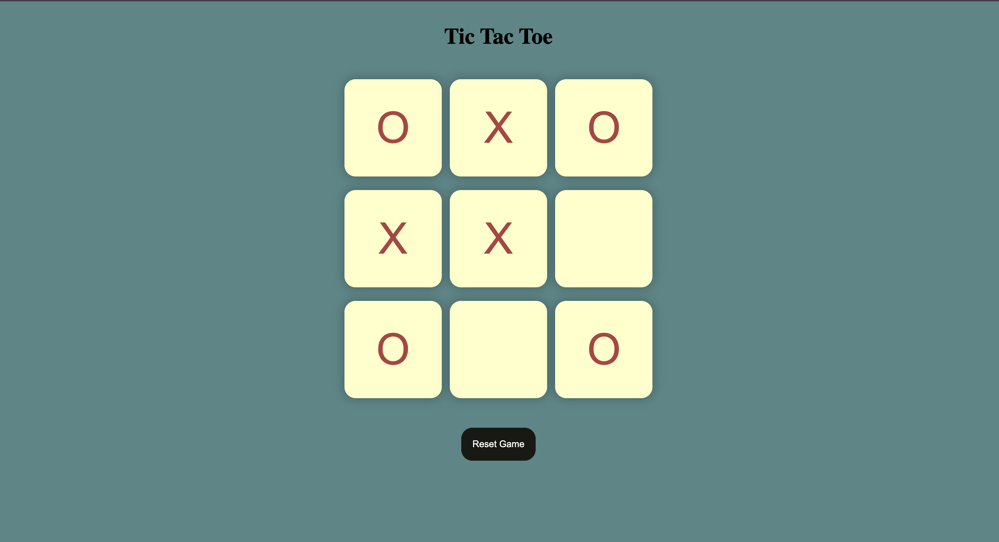
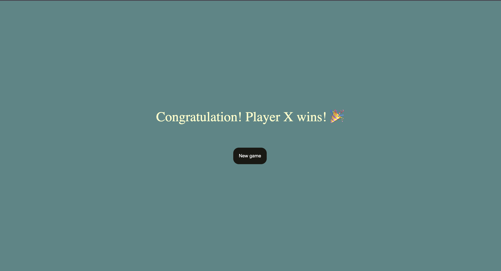

# Tic Tac Toe Game 🎮

An interactive two-player Tic Tac Toe game built with HTML, CSS, and JavaScript while learning JavaScript fundamentals.

## ✨ Features

- Interactive 3×3 game board
- Two-player gameplay (X and O)
- Automatic winner detection
- Winning message with celebration 🎉
- Reset Game functionality
- New Game option

## 🛠️ Technologies Used

- HTML5
- CSS3
- JavaScript

## 📸 Screenshots

### Game Start

### Winner Message

## 🚀 How to Run

1. Clone this repository.
2. Open the project folder.
3. Open `index.html` in your web browser.
4. Start playing!

## 📚 Learning Source

Created as a learning project while studying JavaScript.

## 👨‍💻 Author

**Rabin Chakraborty**